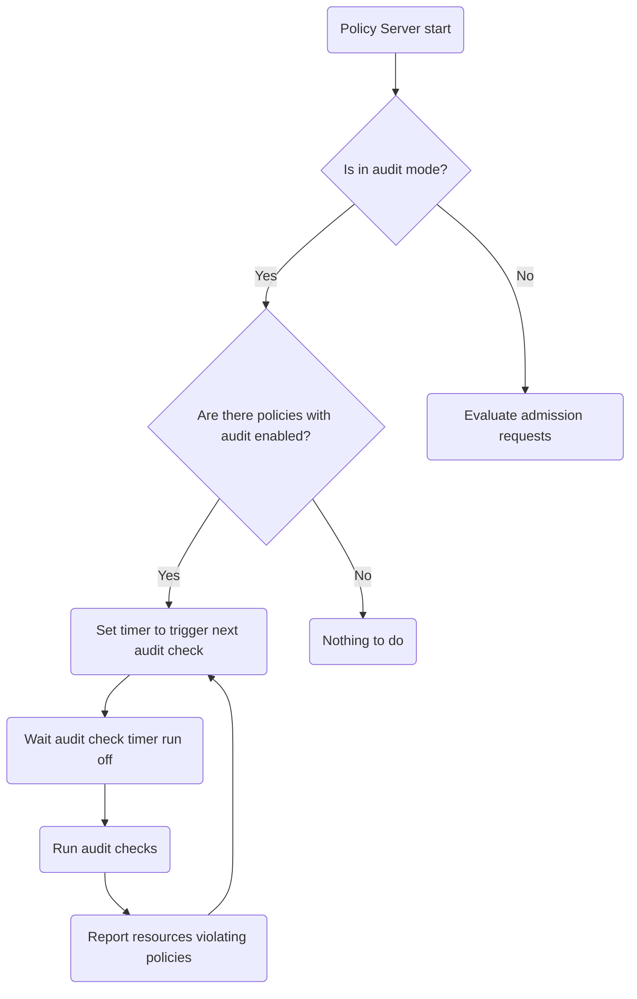

|              |                                  |
| :----------- | :------------------------------- |
| Feature Name | Audit checks                           |
| Start Date   | 08/05/2022                        |
| Category     | enhancement,feature                 |
| RFC PR       | https://github.com/kubewarden/rfc/pull/10  |
| State        | **IN REVIEW**                     |


# Summary

The audit checks inspects  the resources already deployed in the cluster and flags
when something violates some of policies installed in the cluster.

# Motivation

Currently Kubewarden can be used to evaluate Kubernetes resources only when a relevant
operation happens: creation, update, deletion of the resource. However, policies evolve over time.
More policies can be added or they can be redeployed with different settings.
As a result of that, a Kubernetes resource that was marked as valid even a couple of hours ago,
could be instead rejected later on because of a policy change.

We want to implement a audit check that inspects all the resources that are already
present inside of the cluster and flags all the ones that are violating at least one of
the currently enforced policies.

## Examples / User Stories

As a operator, I want to know if some resource in my cluster violates the latest policies.

As a user, I want to know if some of resource that I own violates the cluster compliance policies.

As a Kubernetes developer, I want access to the audit checks results to allow me pro-grammatically act upon it.

# Detailed design

The audit checks will require changes in Kubewarden core components as well as the policies.
In the Kubewarden components is necessary to add new fields to send down to the policies
resources under evaluation during the audit checks. The policies will need to handle this
new field in the `ValidationRequest` in order to work with the audit checks and send back the
result in the `ValidationResponse`. After the policies evaluations a [PolicyReport](https://github.com/kubernetes-sigs/wg-policy-prototypes/tree/master/policy-report)
to store the results will be created.  Furthermore, it's necessary add configuration to allow
users to define the periodicity of the audit check runs.

## Policy server

The audit checks will be executed in a dedicated the policy server running in parallel
with others policy servers evaluating admission requests. This ensure that the audit
checks will not slow down admission requests evaluations as well as remove the need
of implementing a consensus algorithm to sync which policy server will run audit checks
in a high availability setup.  In the "audit check" mode the policy server will
trigger a job to run the policies validating the resources that the policies are
configured to verify.

The policy server needs a configuration to allow user to define policy serve mode
(e.g. `audit`, `evaluation`) and the time between audit checks. Both can be a command
line arguments as well as a environment variables.

The policy server will not run multiple audit checks at the same time.
This means that the next audit check should be scheduled just after the current one is finished.

The policy server running in audit mode will be deployed using our Helm charts.

This is a simple flowchart to show an overview how a policy server will work:



An audit checks consist of the following steps:
1. Get information about which policies have audit checks enabled
2. Get the resources configured in the policies with audit checks enabled
3. Send the resources that a policy is configured to validate to it and get the validation results.
4. Aggregate all the policies validation results
5. Publish a [PolicyReport](https://github.com/kubernetes-sigs/wg-policy-prototypes/tree/master/policy-report) with the aggregated results

In step 2, after fetching the resources for the first time,  they will be stored in a
cache and used again in futures audit checks until the *time to live* period expired.
Triggering another request to the Kubernetes API.

It necessary a configuration to define the *time to live* period used by the cache.

## ClusterAdmissionPolicy and AdmissionPolicy CRDs

It's necessary a change in the policy CRDs to mark a policy to be run in the audit checks.
The field would be called `audit` and its default value will be `true`.
Therefore, all the policies will run in the audit checks by default, unless the user
configure the other way. Example of policies CRDs with the `audit` field:

```yaml
apiVersion: policies.kubewarden.io/v1alpha2
kind: ClusterAdmissionPolicy
metadata:
  name: psp-capabilities
spec:
  policyServer: reserved-instance-for-tenant-a
  module: registry://ghcr.io/kubewarden/policies/psp-capabilities:v0.1.3
  rules:
  - apiGroups: [""]
    apiVersions: ["v1"]
    resources: ["pods"]
    operations:
    - CREATE
    - UPDATE
  mutating: true
  audit: true
  settings:
    allowed_capabilities:
    - CHOWN
    required_drop_capabilities:
    - NET_ADMIN
```

```yaml
apiVersion: policies.kubewarden.io/v1alpha2
kind: AdmissionPolicy
metadata:
  name: psp-capabilities
spec:
  policyServer: reserved-instance-for-tenant-a
  module: registry://ghcr.io/kubewarden/policies/psp-capabilities:v0.1.3
  rules:
  - apiGroups: [""]
    apiVersions: ["v1"]
    resources: ["pods"]
    operations:
    - CREATE
    - UPDATE
  mutating: true
  audit: true
  settings:
    allowed_capabilities:
    - CHOWN
    required_drop_capabilities:
    - NET_ADMIN
```

## Policy server and policies communication

To be able to call policies to evaluate the resources already in the cluster,
it's necessary to add a new fields in the `ValidationRequest` (e.g. `resources`)
and `ValidationRespose` (e.g. `resources_validations`). In the `ValidationRequest`
the field is needed to store  a list of the resources which the policy must validate.
And in the `ValidationResponse` is necessary a field to store a list of the results
of the resources validations given in the `ValidationRequest` type.  This way the
policies will have a unified communication interface.  With no need to implement
additional functions. However, the policies still need to be updated to verify if
this field is populated and, if it is, verify the resources there.

Furthermore, the `policy-evaluator` should also be updated to propagate this field
until the Policy Server where the audit checks will be trigger and the results will be processed.
For that, the types used to store the policies responses as well as the functions used
to process these types and to send the validation request to the policies, must be updated
to add the new fields used to store the audit checks resources and results.

## Audit check results

Once the policy server has the audit checks results, it will populate the a [PolicyReport](https://github.com/kubernetes-sigs/wg-policy-prototypes/tree/master/policy-report).
The report will contains all the success and failures  returned by the policies.
Results from `ClusterAdmissionPolicy` (cluster wide policies) will be stored in the `ClusterPolicyReport`
and the result from the `AdmissionPolicy` (namespaces policies) will be stored in the `PolicyReport`.

The reports should contains some minimum information listed below:

 - Policy name/ID
 - Policy server name/ID
 - Policy validation result (e.g. `success`, `fail`, etc)
 - Policy failure error message, if it exists. The same error message shown to the users if they try to apply an invalid resource in the cluster.
 - Resource identification
 - Policy mode ( `monitor` or `protect` mode)
 - Timestamp of the validation

Any additional information is optional.

# Drawbacks

It's not possible to define if a policy with `audit` field `true` is really
validating the resources in the new added `resources` field before running the audit check.

Download policies one more time. Once for the policy server running in audit mode
and others for the other policy servers

# Alternatives

Additional to the `PolicyReport` report, policy server could add an annotation to the
resources violating policies. However, this will require additional permissions to the policy server.

Policies could have a dedicated function to evaluate resources in the audit checks

If the number of resources for an individual policy is too high, the resources could
be batched and multiple instances of the same policy could be run at the same time
temporally to speed up the policy validations.  This horizontal scaling for all the
policies under demand is a good topic for another RFC or idea discussion for the future.


Run the audit checks in the same policy server where the admissions requests are
evaluated. And use cronjob to trigger audit checks. But considering [that cronjob
can sometimes trigger none or twice a job](https://kubernetes.io/docs/concepts/workloads/controllers/cron-jobs/#cron-job-limitations),
plus some benefits like avoiding competing resources, a separated policy server seems a better idea

Run the audit checks in the same policy server where the admissions requests are
evaluated and implement some consensus algorithm to sync which policy server will
run the audit checks in a high availability scenario.

# Unresolved questions


