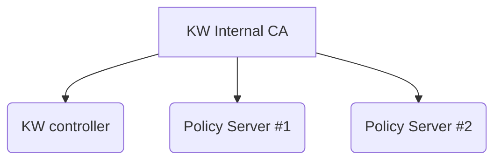

|              |                                 |
| :----------- | :------------------------------ |
| Feature Name | Certificate Handling            |
| Start Date   | Aug 11 2023                     |
| Category     | [Category]                      |
| RFC PR       | [fill this in after opening PR] |
| State        | **ACCEPTED**                    |

# Summary

[summary]: #summary

The goal of this RFC is to summarize the usage of certificates inside of the
Kubewarden stack and come up with a proposal about how to manage them without
having to resort to external dependencies like CertManager.

# Motivation

The first goal of this RFC is to provide a picture of the current state of
certificate handling inside of Kubewarden. How many certificates are used,
by which components, which CA signed them and how have they been generated?

The second goal is to come up with an architecture that removes the external
dependency against CertManager. The new solution should also take into account
certificate rotation.

## Examples / User Stories

> As a Kubernetes operator, I don't want to install CertManager
> in order to deploy Kubearden.

> As a Kubernetes operator,
> I want Kubewarden certificates to be automatically rotated
> before they reach their expiration date.

# Detailed design

## Components that make use of TLS certificates

All the certificates used by the Kubewarden stack are internal to the cluster.
All of them are used to secure the communication between the API Server and different
HTTPS endpoints.

These are the HTTP servers managed by Kubewarden that require TLS termination:

- kubewarden-controller: this is a Validating and Mutating webhook endpoint that
  processes the Kubewarden CRDs (like `PolicyServer`, `ClusterAdmissionPolicy`
  and `AdmissionPolicy`)
- Policy Server: each Deployment has its own dedicated certificate

> **Note:** all these endpoints are either Validating or Mutating webhook
> endpoints for Kubernetes

Currently, Kubewarden 1.6 at the time of wriging, the certificate used by the
kubewarden-controller is generated by CertManager.
On the other hand, the certificates used by the
Policy Server instances are generated by our controller.

The kubewarden-controller generates a self-signed Certificate Authority (CA) that
is then used to sign all the Policy Server certificates.

## Webhook Configuration and Certificates

Both `ValidatingWebhookConfiguration` and `MutatingWebhookConfiguration`
resources have a
[`clientConfig`](https://kubernetes.io/docs/reference/generated/kubernetes-api/v1.27/#webhookclientconfig-v1-admissionregistration-k8s-io)
object inside of their definition.
The `clientConfig.caBundle` has the bundle of CA required to
verify the TLS termination of the webhook endpoint:

```yaml
apiVersion: admissionregistration.k8s.io/v1
kind: MutatingWebhookConfiguration
webhooks:
  - name: my-webhook.example.com
    clientConfig:
      caBundle: <CA_BUNDLE>
      service:
        namespace: my-service-namespace
        name: my-service-name
        path: /my-path
        port: 1234
```

We have one `MutatingWebhookConfiguration` resource used by the kubewarden-controller which
holds a reference to the CA managed by CertManager.

Each `ClusterAdmissionPolicy` and `AdmissionPolicy` has a dedicated `(Validating|Mutating)WebhookConfiguration`
object defined. For all of them, the `clientConfig.caBundle` contains the certificate of
the CA generated by our controller.

## Proposed Design

We would like to get rid of CertManager. To do that we need to change how certificates are
managed for the `kubewarden-controller`.
Going forward, the controller will also take care of generating the certificate used by the kubewarden-controller.
This certificate is going to be signed by the CA which is already created by the controller.



## Possible Scenarios

This section aims to cover the different scenarios. For each one of them we start by defining an event
and then we outline the different actions that have to be done.

### Kubewarden Fresh Install

The Kubewarden stack has just been installed. The following actions have to be done:

- Generate Certificate Authority
- Generate certificate for `kubewarden-controller` and sign it with our CA
- Start the Kubewarden controller HTTPS server using this certificate
- Register the webhook against the Kubernetes API, using the certificate of our CA inside of
  `clientConfig.caBundle`

### New Policy Server Defined

A new `PolicyServer` is defined, the following actions have to be done:

- Generate new certificate, sign it with our CA
- Create Policy Server Deployment, ensure the certificate is mounted inside of the Pods

This is already done by our current code (Kubewarden 1.6.0).

### New `AdmissionPolicy`/`ClusterAdmissionPolicy` is defined

A new policy is defined inside of the cluster, ensure the following action are done:

- Register the webhook against the Kubernetes API, use our CA inside of `clientConfig.caBundle`

> **Note:** it doesn't matter which Policy Server is going to host the policy. All the Policy Server
> instances use a certificate that is signed by our CA. Hence we always put our CA
> inside of the `clientConfig.caBundle`.

This is already done by our current code (Kubewarden 1.6.0).

### Policy Server Certificate Renewed

From time to time we need to renew the certificate issued to a Policy Server instance. The main reason
to perform this operation is to ensure the Policy Server is not using an expired certificate.

To renew a Policy Server certificate the following actions have to be done:

- Generate new certificate, sign it with our CA
- Force a rollout of the Policy Server deployment. This will ensure the HTTPS server uses the new certificate

> **Note:** there's no need to touch the webhook configuration objects related to the policies
> hosted by the Policy Server. The new certificate is still signed by the same CA, hence nothing has
> to be changed.

### Internal CA changes

The internal CA managed by Kubewarden might be recreated (for example, to avoid its expiration). This is the
most disruptive event that can happen, especially once some policies are deployed.

Once the new CA is generated, the following actions have to be performed:

- For each `PolicyServer` defined:
  - Generate a new certificate, sign it with the new CA
  - Force a rollout of the PolicyServer Deployment
- Kubewarden Controller:
  - Generate a new certificate, sign it with the new CA
  - Restart the controller to ensure its HTTPS endpoint uses the new certificate
- For each webhook configuration managed by Kubewarden (meaning all the policies deployed, plus the kubewarden-controller):
  - Update the `clientConfig.caBundle`: ensure it contains the certificate of the new CA

This change is massive and could lead to connection errors for as long as the PolicyServer are using a certificate
signed by a CA that is not the one mentioned inside of the `clientConfig.caBundle`.

## Controller Bootstrap

At startup, the kubewarden-controller must ensure the root CA has been created. Currently (Kubewarden 1.6.0), the
controller creates the root CA only when the 1st PolicyServer object is defined.
We can keep creating a root CA that expires after 10 years.

The code must also ensure the root CA is not about to expire. When this scenario is detected, the controller must renew
the root CA.

## Reconciliation Loops

This section describes how the kubewarden-controller reconciliation loops should be arranged.

Currently we have these reconciliation loops:

- `PolicyServer`
- `ClusterAdmissionPolicy`
- `AdmissionPolicy`

### Policy Server

Reconciliation loops are triggered whenever an event dealing with a watched resource happens.
In this case it could be the create/update/delete of a `PolicyServer`.
The reconciliation loop is also triggered every X seconds as a way to cope with possible glitches
with the event notification system.

At the beginning of the reconciliation loop, the code should check the expiration date of the
certificate used by the Policy Server. If the certificate is about to expire a new one should be
created. Check the previous section to see which actions have to be done in this circumstance.

The loop should also monitor changes done to the secret that holds the internal CA.
The reconciliation loop should then make sure that the Policy Server certificate has been signed by
our CA. If not, a new certificate should be issued (like during a renewal).

> Note: checking if the Policy Server certificate has been issued by our CA might be computationally intense.
> We have to ensure this is not going to cause a CPU spike. We could resort to do something clever using
> the revision number of the Secret that holds the CA.

### ClusterAdmissionPolicy

The reconciliation loop should watch also the Secret object that contains the root CA certificate.

During the reconciliation loop, the code must ensure the
`(Validating|Mutating)WebhookConfiguration` object related with the `ClusterAdmissionPolicy`
has the `clientConfig.caBundle` properly configured. The field must container the certificate of the internal root CA.

### AdmissionPolicy

The reconciliation loop should watch also the Secret object that contains the root CA certificate.

During the reconciliation loop, the code must ensure the
`(Validating|Mutating)WebhookConfiguration` object related with the `AdmissionPolicy`
has the `clientConfig.caBundle` properly configured. The field must container the certificate of the internal root CA.

# Drawbacks

[drawbacks]: #drawbacks

No significant drawback is introduced by this RFC. Our codebase already handles the certificate
creation for all the Policy Server instances.

On the other hand, we are not yet handling certificate rotation. Hence the implementation of this
RFC will improve the end user experience and make Kubewarden more robust.

# Alternatives

[alternatives]: #alternatives

Unfortunately there are no alternatives, since delegating certificate management to CertManager
is not an option. Even if that was an option, we would still have to deal with some aspects
of certificate management like handling the `(Validating|Mutating)WebhookConfiguration`
resources.

# Unresolved questions

[unresolved]: #unresolved-questions

The renewal of the root CA is the most disruptive event that can happen. Letting the reconciler loops run and wait
for the system to converge towards the desired state is not a viable option. During the convergence
time there could be requests being rejected due to Policy Server instances not being available or be using
a certificate signed by an unexpected root CA.

We must do some research and find a way to reduce this disruption. However, given our root CA has an expiration
time of 10 years, this is a problem that should not block the implementation of this RFC.
