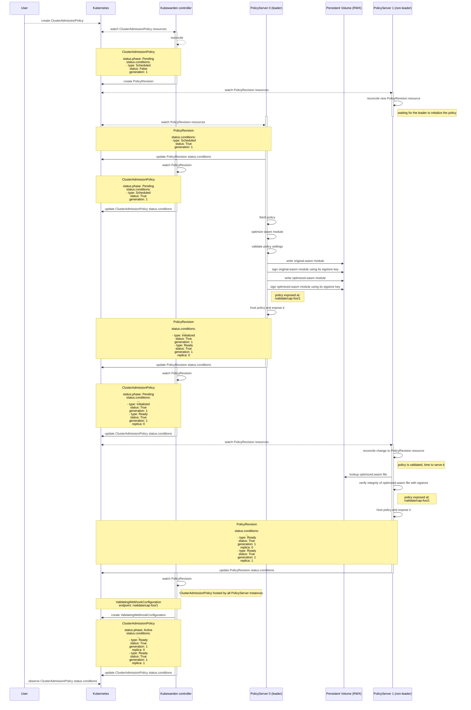
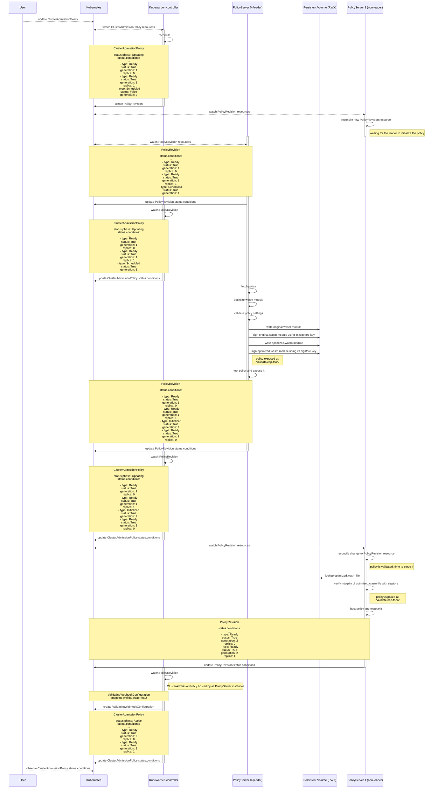

|              |                                                  |
| :----------- | :----------------------------------------------- |
| Feature Name | Policy lifecycle                                 |
| Start Date   | 19/12/2024                                       |
| Category     | enhancement, feature                             |
| RFC PR       | [#44](https://github.com/kubewarden/rfc/pull/44) |
| State        | **ACCEPTED**                                     |

# Summary

[summary]: #summary

This RFC introduces a revised policy lifecycle for Kubewarden, enabling users to monitor the status of a policy on a specific Policy Server replica.
The new lifecycle enhances the Policy Server's resilience to failures and facilitates seamless policy updates without requiring server restarts.
Additionally, the user will be able to rollback to a previous policy version in case of issues with the latest policy.

# Motivation

[motivation]: #motivation

This change addresses a critical issue with the Policy Server.
Currently, a policy can fail to load for a variety of reasons. For example, an inability to pull from the registry or incorrect settings. This causes the Policy Server to exit with an error, causing the pod to enter a CrashLoopBackOff state.
Resolving this requires inspecting the error messages from the Policy Server pod and fixing the underlying issue.
However, a user might have the permissions to create a policy but lack the necessary permissions to check the logs of the Policy Server. This presents challenges to diagnosis and resolution of problems.
Additionally, when updating a policy, there is no status reported to indicate the failure. The policy remains in the Active state even while the Policy Server is stuck in a crash loop.
This creates a significant risk, as new Policy Server pods might fail to start, and the old ones running the previous functional configuration could be lost if their node becomes unavailable.
This situation can disrupt the cluster, as all incoming admission requests will be denied in the absence of operational Policy Server instances.

The proposed changes aim to address these issues by introducing a new policy lifecycle that includes the following features:

- Hot reload of policies: The Policy Server will be able to load a new policy without requiring a restart.
- Policy validation: The Policy Server will validate the policy before loading it, ensuring correct pre-compilation and loading.
- Policy status monitoring: The Policy Server will report the status of the policy, indicating whether it was loaded successfully or if an error occurred.
- Policy versioning: The Policy Server will keep running with a previous version of the policy in case of issues with the latest policy.
- Policy rollback: The user will be able to rollback to a previous policy version in case of issues with the latest policy.

## Examples / User Stories

[examples]: #examples

- As a user, I want to load a new policy or update an existing policy without requiring a restart of the policy server.
- As a user, I want to know if a policy was successfully pulled, precompiled, and validated.
- As a user, I want to monitor the status of a policy on a specific policy server replica so that I can identify and resolve issues with the policy.
- As a user, I want the policy server to remain running with a previous version of the policy in case of issues with the latest policy.
- As a user, I want to rollback to a previous policy version in case of issues with the latest policy.
- As a user, I want to debug issues with the namespaced policies I own without involving the cluster administrator.

# Detailed design

[design]: #detailed-design

> Note: In this RFC, the term `Policy` will be used to refer to any of the following resources: `AdmissionPolicy`, `ClusterAdmissionPolicy`, `AdmissionPolicyGroup`, or `ClusterAdmissionPolicyGroup`.

## Concepts

To implement the new policy lifecycle, we introduce the following concepts:

### Hot reload

The Policy Server will be able to load a new policy without requiring a restart.
This will be achieved by refactoring the `EvaluationEnvironment` and adding methods to set, update, and remove policies.

### The Policy Server acts as a controller

Currently, the Policy Server is configured with a ConfigMap that contains all the policies to be loaded.
When a new policy is created, the ConfigMap is updated, and the Policy Server is restarted to load the new policy.

We want to change this behavior to allow the Policy Server to act as a controller that can load new policies without requiring a restart.

#### PolicyRevision CRD

We will introduce a new CRD called `PolicyRevision` to store the state of a policy in relation to the Policy Server replicas.
`PolicyRevisions` are namespaced resources, and they will be created in the same namespace as the Kubewarden controller.

The `PolicyRevision` will include fields to store the policy content and an `enabled` field to specify whether the policy should be served by the Policy Server.
The `PolicyRevision` will include a `policyGeneration` field to store the generation of the associated `Policy`.
This field will be set to the value of `metadata.generation` from the `Policy` CRD at the time the `PolicyRevision` is created.
This approach allows the Policy Server to manage multiple generations of a policy at the same time, facilitating the gradual rollout of updates.

This is similar to the `Deployment` and `ReplicaSet` relationship in Kubernetes, where the `Deployment` defines the desired state at a higher level of abstraction,
and the `ReplicaSet` is responsible for managing the current state to align with this desired state.
Additionally, `ReplicaSets` also store the backup of older `Deployment` revisions, enabling rollback to a previous state if needed.
The `PolicyRevision` will also store the older policy to a maximum of `n` revisions, where `n` is a configurable value.
This will allow users to rollback to a previous policy version if needed.

In summary:

- A `Policy` specifies the desired state of a policy.
- One or more `PolicyRevisions` with `enabled` set to `true` represent the active policies currently served by the Policy Server.
- A `PolicyRevision` with `enabled` set to `true` and `policyGeneration` matching the current generation of the `Policy` represents the desired state of the policy within the Policy Server's evaluation environment.
- `PolicyRevisions` with `enabled` set to `false` represents previous states of the policies, retained for potential rollback scenarios.

When a new Policy is created, the Kubewarden controller will create a new `PolicyRevision` resource with the policy content and set the `enabled` field to `true`.
Additionally, the Kubewarden controller will add a `kubewarden.io/policy-server` label to the `PolicyRevision` to filter the policies for a specific Policy Server.

For example, given the following `ClusterAdmissionPolicy`:

```yaml
apiVersion: policies.kubewarden.io/v1
kind: ClusterAdmissionPolicy
metadata:
  generation: 1
  name: privileged-pods
spec:
  policyServer: reserved-instance-for-tenant-a
  module: registry://ghcr.io/kubewarden/policies/pod-privileged:v0.2.2
  rules:
    - apiGroups: [""]
      apiVersions: ["v1"]
      resources: ["pods"]
      operations:
        - CREATE
        - UPDATE
  mutating: false
status:
  conditions:
    - type: Pending
      status: True
      reason: PolicyPending
      message: "The policy was created and is pending to be loaded"
```

The controller will create the `PolicyRevision` resource as follows:

```yaml
apiVersion: policies.kubewarden.io/v1
kind: PolicyRevision
metadata:
  name: clusterwide-privileged-pods-6469c6d5f6 # we will use the Policy unique name and a random suffix
  namespace: kubewarden # the namespace of the controller
  labels:
    kubewarden.io/policy-server: reserved-instance-for-tenant-a # this is needed to filter the PolicyRevisions for a specific PolicyServer
spec:
  objectReference:
    apiVersion: policies.kubewarden.io/v1
    kind: ClusterAdmissionPolicy
    name: privileged-pods
  policyGeneration: 1
  enabled: true
  data: # data will contain the policy.spec contents
    spec:
      policyServer: reserved-instance-for-tenant-a
      module: registry://ghcr.io/kubewarden/policies/pod-privileged:v0.2.2
      rules:
        - apiGroups: [""]
          apiVersions: ["v1"]
          resources: ["pods"]
          operations:
            - CREATE
            - UPDATE
      mutating: false
status:
  conditions:
    - type: Pending
      status: True
      reason: PolicyPending
      message: "The policy was created and is waiting to be loaded"
```

The `PolicyRevision` is comparable to the [`ControllerRevision`](https://kubernetes.io/docs/reference/kubernetes-api/workload-resources/controller-revision-v1/) resource in Kubernetes.
The data field is of type `RawExtension`, allowing it to store any policy type.

The Policy Server replicas will be watching the new `PolicyRevision` CRD directly and it will change the internal state of the evaluation environment when a new policy is created or updated.

#### PolicyServer leader reconciler

A leader election mechanism will be implemented to ensure that only one Policy Server instance is running the leader reconciler at a time.
The leader will be responsible to pull the policies from the registry, validate the policy settings, precompile the policy and store it in a shared cache. See [Shared Policy Cache](#shared-policy-cache) for more details.
We will rely on [Kubernetes Leases](https://kubernetes.io/docs/concepts/architecture/leases/) for this functionality, using the same mechanism employed by controllers scaffolded with Kubebuilder to elect a leader.
Since the Policy Server is implemented in Rust, we will use the [kubert](https://docs.rs/kubert/0.22.0/kubert/lease/index.html) crate's lease module for this purpose.
These features are not provided by the `kube-rs` crate, but kubert is built on top of `kube-rs`, is actively maintained, and is used in production by [Linkerd](https://linkerd.io/).

After the policy is precompiled, the leader will change the status condition of type `Initialized` of the `PolicyRevision` to `True`.
This will trigger the replica reconciler to load the policy in the evaluation environment of all the policy server pods that are part of the StatefulSet.

#### Policy Server replica reconciler

All the replicas, including the leader, will be running a reconciliation loop to configure the policies in the evaluation environment.
The replicas will be watching the `PolicyRevision` CRDs and load the policy in the evaluation environment when the status condition of type `Initialized` is set to `True` and the `enabled` field is set to `true`.
In case of an error, the policy status will be updated, but the Policy Server will continue serving the previous valid policy until the issue is resolved.
This is possible because multiple `PolicyRevisions` can be enabled at the same time.
The Policy Server provides access to current policies through the `/validate` endpoint, incorporating the `generation` number as a URL parameter.
This setup enables the webhook to target a specific policy generation.
For example, the endpoint `/validate/privileged-pods/2` validates requests using the `privileged-pods` policy at generation 2.

#### Policy and PolicyRevision conditions

The `PolicyRevision` CRD will have a status field to store the status of the policy.
The status will be propagated to the `Policy` CRD by the controller, so that the user can monitor the status of the policy without having to access the `PolicyRevision` CRD.
As the `PolicyRevision` CRD is a namespaced resource, only admin users will have the right permissions to access it.

#### PolicyServer bootstrap

When the Policy Server starts, it will load the policy from the `PolicyRevision` resources where the `enabled` field is set to `true` if the status condition of type `Initialized` is set to `True`.
If the `PolicyRevision` is `enabled` but the status condition is not `Initialized`, the Policy Server leader will be in charge of the initialization process.
If the `PolicyRevision` is not `enabled`, the Policy Server will not load the policy, as the policy is not meant to be served.
If a Policy Server replica fails to load the policy from a `PolicyRevision` CRD, it will exit with an error.
Since Kubernetes removes the pod from the service endpoints during a restart or a termination, the Policy Server service will remain consistent, ensuring that no server operates without a valid policy.

### Shared Policy Cache

The Policy Server will use a shared cache to store precompiled policies.
This cache can be shared across all Policy Server replicas by using a [RWX (ReadWriteMany) Persistent Volume](https://kubernetes.io/docs/concepts/storage/persistent-volumes/).
RWX Persistent Volumes are supported by most cloud providers and Kubernetes distributions.

To precompile a policy, we will use [`wasmtime::Engine::precompile_module`](https://docs.rs/wasmtime/latest/wasmtime/struct.Engine.html#method.precompile_module), which generates a binary blob. This blob will then be saved to disk.
Non-leader instances can later load the precompiled module using [`wasmtime::Module::deserialize_file`](https://docs.rs/wasmtime/latest/wasmtime/struct.Module.html#method.deserialize_file).

#### Limitations: Compatibility of Precompiled Modules

Precompiled modules can only be reused by another `wasmtime::Engine` if the following conditions are met:

1. **Same Wasmtime version**: Both the "optimizer" (the engine that precompiled the module) and the end consumer must use the same version of Wasmtime.
2. **Same Wasmtime configuration**: Both must use the same `wasmtime::Config`. For example, enabling features like [async support](https://docs.rs/wasmtime/latest/wasmtime/struct.Config.html#method.async_support) or [epoch interruption](https://docs.rs/wasmtime/latest/wasmtime/struct.Config.html#method.epoch_interruption) on the consumer side, while the optimizer does not, will result in a loading error.

This is documented [here](https://docs.rs/wasmtime/latest/wasmtime/struct.Module.html#method.deserialize):

> Note that this function is designed to be safe receiving output from any compiled version of Wasmtime itself.
> This means that it is safe to feed output from older versions of Wasmtime into this function, in addition to newer versions of Wasmtime (from the future!).
> These inputs will deterministically and safely produce an Err. This function only successfully accepts inputs from the same version of Wasmtime,
> but the safety guarantee only applies to externally-defined blobs of bytes, not those defined by any version of Wasmtime.
> (this means that if you cache blobs across versions of Wasmtime you can be safely guaranteed that future versions of Wasmtime will reject old cache entries).

Wasmtime ensures safety by producing an error when an incompatible version of a module is loaded. This allows us to handle such errors gracefully by re-optimizing the module as needed.
Please refer to the [Wasmtime documentation](https://docs.rs/wasmtime/latest/wasmtime/struct.Config.html#method.module_version) for more information about module version strategies.

Therefore, we need to store precompiled modules by appending the Policy Server version to the module name.
The original module will remain in the shared cache, enabling the Policy Server to recompile it when necessary, such as when the Policy Server version changes.
This ensures compatibility when the Policy Server is updated, and the precompiled modules might no longer work with the new version.
Example: `/cache/ghcr.io/kubewarden/policies/safe-labels/v1.0.0/optimized-kw-v1.28.1.wasm`.
Where `v1.0.0` is the policy version and `v1.28.1` the policy-server version.

#### Security Implications

Loading precompiled binary blobs from a shared cache introduces potential security risks.
An attacker could replace a valid binary blob with one that runs arbitrary malicious code.

To mitigate this risk, we will use [sigstore](https://github.com/sigstore)'s signing capabilities to sign and verify all binary blobs.
By leveraging Kubewarden's internal certificate authority (CA), we can generate a certificate and private key for the leader to sign blobs, ensuring that only trusted and verified blobs are used.

### The Policy Server is a StatefulSet

The Policy Server will be deployed as a StatefulSet to ensure that each replica has a unique identity.
This will allow us to identify the status of a policy on a specific Policy Server replica.

### Policy Status

#### Status Conditions

We will use the [status conditions](https://github.com/kubernetes/community/blob/master/contributors/devel/sig-architecture/api-conventions.md#typical-status-properties) convention to report the status of the policy.
The status condition struct will be extended to include the replica number.
The approach of extending the status condition struct is already used in the Kubernetes codebase,
for example in the [Pod conditions](https://kubernetes.io/docs/concepts/workloads/pods/pod-lifecycle/#pod-conditions).

The `PolicyStatusCondition` struct will have the following fields:

| **Field name**         | **Description**                                                                                     |
| ---------------------- | --------------------------------------------------------------------------------------------------- |
| **type**               | Name of the policy condition.                                                                       |
| **status**             | Indicates whether the condition is applicable, with possible values: "True", "False", or "Unknown". |
| **reason**             | Machine-readable reason for the condition's last transition, in UpperCamelCase format.              |
| **message**            | Human-readable message providing details about the last transition.                                 |
| **generation**         | The generation of the `Policy` the status is referring to.                                          |
| **replica** (optional) | The replica number reporting the status.                                                            |

The `Policy` CRD and the `PolicyRevision` CRD will be updated to include the status conditions.
See the [Policy and PolicyRevision conditions](#policy-and-policyrevision-conditions) section for more details on how the status conditions will be propagated.

The following `PolicyConditions` will be observed:

- `Scheduled`: The policy was created and is pending to be loaded.
- `Initialized`: The policy was successfully pulled, precompiled and validated by the leader.
- `Ready`: The policy was successfully loaded and is ready to be used. This status will include the replica number.

By using the `reason` field in the status condition, we can provide detailed information in case of an error.
For instance if the leader fails to initialize a policy because of registry error, the following status condition will be set:

```yaml
conditions:
  - type: Initialized
    status: False
    reason: PullError
    message: "Cannot pull the policy from the registry."
    generation: 1
```

#### Policy phase

Similar to the Pod phase, a phase field will be added to the Policy CRD.
The phase of a Policy is a simple, high-level summary of where the policy is in its lifecycle.

Here are the possible values for `phase`:

- `Pending`: The policy was created and is pending to be loaded.
- `Updating`: The policy was previously `Active`, has been updated, and the new version is awaiting loading. The old revision remains available and is still being served.
- `Active`: The policy was successfully loaded and is ready to be used.
- `Failed`: The policy failed to load.

### Kubernetes Events

The controller will generate [Kubernetes Events](https://kubernetes.io/docs/reference/kubernetes-api/cluster-resources/event-v1/) to reflect the status of a policy.
Events will be created during policy status transitions, such as when a new policy is created, updated, successfully loaded, or encounters an error.
This enables users to track the policy's status using `kubectl get events`.

### Rollback

If a policy fails to load, the Policy Server will keep running with the previous valid policy.
The user will be able to rollback to a previous policy version by updating the `Policy` CRD (via a spec field or an annotation, TBD).
The controller will detect the change and use the `PolicyRevision` CRD to update the Policy CRD with the previous configuration.

### Garbage Collection

When a `Policy` is deleted, the controller will also delete all associated `PolicyRevisions`.
Using the `OwnerReference` field is not feasible in this case, as the `PolicyRevision` may reside in a different namespace than the `AdmissionPolicy` or `AdmissionPolicyGroup`,
or it could be versioning a `ClusterAdmissionPolicy` or `ClusterAdmissionPolicyGroup`, which are cluster-scoped resources.

We will also need to implement a garbage collection mechanism to remove old precompiled modules from the shared cache.
This will prevent the cache from growing indefinitely and consuming unnecessary resources.

## Policy Lifecycle

Given the concepts described above, the policy lifecycle will be as follows:

### Policy Creation

1. The user creates a new `Policy`.
2. The Kubewarden controller sets the phase of the `Policy` to `Pending`.
3. The Kubewarden controller creates a new `PolicyRevision` resource with the policy content and sets the `enabled` field to `true`.
   It also sets the `policyGeneration` field to the value of `metadata.generation` from the `Policy` CRD. It adds the `Scheduled` status condition set to `False` to both the `Policy` and `PolicyRevision` CRDs.
4. The new `PolicyRevision` triggers the leader reconciler. The Policy Server leader sets the status condition of type `Scheduled` of the `PolicyRevision` to `True`.
   - If Policy Server specified in the `Policy` CRD is not running, the status condition of type `Scheduled` will be set to `False` with the appropriate reason and message.
5. The Kubewarden controller propagates the status condition to the `Policy` CRD.
6. The Policy Server leader pulls the policy from the registry, precompiles the policy, and stores it in the shared cache.
7. The Policy Server leader validates the policy settings.
8. The Policy Server leader changes the status condition of type `Initialized` of the `PolicyRevision` to `True`.
   - If an error occurred in the previous steps, the status condition of type `Initialized` will be set to `False` with the appropriate reason and message.
     The phase of the `Policy` will be set to `Failed` by the Kubewarden controller.
9. The Kubewarden controller propagates the status condition to the `Policy` CRD.
10. The replica reconciler of all the replicas including the leader loads the policy in the evaluation environment.
11. Every replica will report the status of the policy to the `PolicyRevision` CRD, setting the status condition of type `Ready` to `True`.
    - If an error occurs, the status condition of type `Ready` will be set to `False` with the appropriate reason and message.
      The phase of the `Policy` will be set to `Failed` by the Kubewarden controller.
12. The `Ready` status is propagated to the `Policy` CRD.
13. When all the replicas have set the `Ready` status to true, the Kubewarden controller creates a Webhook configuration pointing to the `PolicyRevision` generation.
    - If an error occurred in the previous steps, the controller will not update the Webhook configuration. The phase of the `Policy` will be set to `Failed`.
14. The phase of the `Policy` will be set to `Active` by the Kubewarden controller.
15. The policy is now ready to be used.

### Sequence diagram



### Policy Update

1. The user updates an existing `Policy`.
2. The Kubewarden controller sets the phase of the `Policy` to `Updating`.
3. The Kubewarden controller creates a new `PolicyRevision` resource with the policy content and sets the `enabled` field to `true`.
   It also sets the `policyGeneration` field to the value of `metadata.generation` from the `Policy` object and adds the `Scheduled` status condition set to `False` to both the `Policy` and `PolicyRevision` CRDs.
4. The new `PolicyRevision` triggers the Policy Server leader reconciler. The Policy Server leader sets the status condition of type `Scheduled` of the `PolicyRevision` to `True`.
5. The Kubewarden controller propagates the `Scheduled` status condition to the `Policy` CRD by adding a new condition with the generation of the `PolicyRevision`.
   The conditions of the previous `PolicyRevision` will be preserved.
6. The Policy Server leader pulls the policy from the registry, precompiles the policy, and stores it in the shared cache.
7. The Policy Server leader validates the policy settings.
8. The Policy Server leader changes the status condition of type `Initialized` of the `PolicyRevision` to `True`.
   - If an error occurred in the previous steps, the status condition of type `Initialized` will be set to `False` with the appropriate reason and message.
     The phase of the `Policy` will be set to `Failed` by the Kubewarden controller.
9. The Kubewarden controller propagates the status condition to the `Policy` CRD by adding a new condition with the generation of the `PolicyRevision`.
10. The replica reconciler of all the replicas including the leader loads the policy in the evaluation environment.
11. Every replica will report the status of the policy to the `PolicyRevision` CRD, setting the status condition of type `Ready` to `True`.
    - If an error occurs, the status condition of type `Ready` will be set to `False` with the appropriate reason and message.
      The phase of the `Policy` will be set to `Failed` by the Kubewarden controller.
12. The `Ready` status is propagated to the `Policy` CRD by adding a new condition with the generation of the `PolicyRevision`.
13. When all the replicas have set the `Ready` status to true, the Kubewarden controller updates the Webhook configuration pointing to the `PolicyRevision` generation.
    - If an error occurred in the previous steps, the controller will not update the Webhook configuration.
      The phase of the `Policy` will be set to `Failed` by the Kubewarden controller.
14. The Kubewarden controller updates the phase of the `Policy` to `Active`.
15. The policy is now ready to be used.
16. The Kubewarden controller sets the `enable` field of the previous `PolicyRevision` to `false`.
17. As a result, the Policy Server replicas will stop serving the previous policy dropping the wasm module from the memory.
18. The Kubewarden controller garbage collects the old `PolicyRevisions` and precompiled modules, keeping only the last `n` revisions.
19. The Kubewarden controller removes the conditions of the old `PolicyRevision` from the `Policy` CRD.

#### Sequence diagram



### Example status transitions

The `Policy` is created:

```yaml
status:
  conditions:
    - type: Scheduled
      status: False
      reason: WaitingForPolicyServer
      message: "The policy was created and is pending to be loaded."
      generation: 1
```

The `PolicyServer` leader has received the `PolicyRevision`:

```yaml
status:
  conditions:
    - type: Scheduled
      status: True
      reason: PolicyScheduled
      message: "The policy was scheduled by the PolicyServer."
      generation: 1
```

The `PolicyServer` leader has pulled, precompiled, validated and stored the policy:

```yaml
status:
  conditions:
    - type: Scheduled
      status: True
      reason: PolicyScheduled
      message: "The policy was scheduled by the PolicyServer."
      generation: 1
    - type: Initialized
      status: True
      reason: PolicyInitialized
      message: "The policy was successfully initialized."
      generation: 1
```

The `PolicyServer` leader has loaded the policy:

```yaml
status:
  conditions:
    - type: Scheduled
      status: True
      reason: PolicyScheduled
      message: "The policy was scheduled by the PolicyServer."
      generation: 1
    - type: Initialized
      status: True
      reason: PolicyInitialized
      message: "The policy was successfully initialized."
      generation: 1
    - type: Ready
      status: True
      reason: PolicyReady
      message: "The policy is ready to be used."
      generation: 1
      replica: 0
```

The other replicas have loaded the policy:

```yaml
status:
  conditions:
    - type: Scheduled
      status: True
      reason: PolicyScheduled
      message: "The policy was scheduled by the PolicyServer."
      generation: 1
    - type: Initialized
      status: True
      reason: PolicyInitialized
      message: "The policy was successfully initialized."
      generation: 1
    - type: Ready
      status: True
      reason: PolicyReady
      message: "The policy is ready to be used."
      generation: 1
      replica: 0
    - type: Ready
      status: True
      reason: PolicyReady
      message: "The policy is ready to be used."
      generation: 1
      replica: 1
    - type: Ready
      status: True
      reason: PolicyReady
      message: "The policy is ready to be used."
      generation: 1
      replica: 2
```

The `Policy` is updated:

```yaml
status:
  conditions:
    - type: Scheduled
      status: True
      reason: PolicyScheduled
      message: "The policy was scheduled by the PolicyServer."
      generation: 1
    - type: Initialized
      status: True
      reason: PolicyInitialized
      message: "The policy was successfully initialized."
      generation: 1
    - type: Ready
      status: True
      reason: PolicyReady
      message: "The policy is ready to be used."
      generation: 1
      replica: 0
    - type: Ready
      status: True
      reason: PolicyReady
      message: "The policy is ready to be used."
      generation: 1
      replica: 1
    - type: Ready
      status: True
      reason: PolicyReady
      message: "The policy is ready to be used."
      generation: 1
      replica: 2
    - type: Scheduled
      status: False
      reason: WaitingForPolicyServer
      message: "The policy was created and is pending to be loaded."
      generation: 2
```

The `PolicyServer` leader has received the updated `PolicyRevision`:

```yaml
status:
  conditions:
    - type: Scheduled
      status: True
      reason: PolicyScheduled
      message: "The policy was scheduled by the PolicyServer."
      generation: 1
    - type: Initialized
      status: True
      reason: PolicyInitialized
      message: "The policy was successfully initialized."
      generation: 1
    - type: Ready
      status: True
      reason: PolicyReady
      message: "The policy is ready to be used."
      generation: 1
      replica: 0
    - type: Ready
      status: True
      reason: PolicyReady
      message: "The policy is ready to be used."
      generation: 1
      replica: 1
    - type: Ready
      status: True
      reason: PolicyReady
      message: "The policy is ready to be used."
      generation: 1
      replica: 2
    - type: Scheduled
      status: True
      reason: PolicyScheduled
      message: "The policy was scheduled by the PolicyServer."
      generation: 2
```

The `PolicyServer` leader has pulled, precompiled, validated and stored the updated policy:

```yaml
status:
  conditions:
    - type: Scheduled
      status: True
      reason: PolicyScheduled
      message: "The policy was scheduled by the PolicyServer."
      generation: 1
    - type: Initialized
      status: True
      reason: PolicyInitialized
      message: "The policy was successfully initialized."
      generation: 1
    - type: Ready
      status: True
      reason: PolicyReady
      message: "The policy is ready to be used."
      generation: 1
      replica: 0
    - type: Ready
      status: True
      reason: PolicyReady
      message: "The policy is ready to be used."
      generation: 1
      replica: 1
    - type: Ready
      status: True
      reason: PolicyReady
      message: "The policy is ready to be used."
      generation: 1
      replica: 2
    - type: Scheduled
      status: True
      reason: PolicyScheduled
      message: "The policy was scheduled by the PolicyServer."
      generation: 2
    - type: Initialized
      status: True
      reason: PolicyInitialized
      message: "The policy was successfully initialized."
      generation: 2
```

All the replicas have loaded the updated policy, the old policy conditions are removed from the status:

```yaml
status:
  conditions:
    - type: Scheduled
      status: True
      reason: PolicyScheduled
      message: "The policy was scheduled by the PolicyServer."
      generation: 2
    - type: Initialized
      status: True
      reason: PolicyInitialized
      message: "The policy was successfully initialized."
      generation: 2
    - type: Ready
      status: True
      reason: PolicyReady
      message: "The policy is ready to be used."
      generation: 2
      replica: 0
    - type: Ready
      status: True
      reason: PolicyReady
      message: "The policy is ready to be used."
      generation: 2
      replica: 1
    - type: Ready
      status: True
      reason: PolicyReady
      message: "The policy is ready to be used."
      generation: 2
      replica: 2
```

## PolicyServer Lifecycle

### Rolling Update

When a new version of the Policy Server is deployed, the StatefulSet will perform a rolling update.
The [`RollingUpdate`](https://kubernetes.io/docs/tutorials/stateful-application/basic-stateful-set/#rolling-update) strategy will ensure that only one replica updates at a time, starting from the highest ordinal number.

As each updated replica starts, it will:

1. List all `PolicyRevisions` where the `enabled` field is set to `true`.
2. Load the corresponding module from the shared cache.
3. Check if the module was precompiled with an older Policy Server version.
   - If so, the module will be recompiled with the new version and saved to the shared cache before loading. See [Shared Policy Cache](#shared-policy-cache) for more details.

This process happens even if the replica is not the leader, ensuring that the precompiled module is ready for other replicas as they start.

### Scaling Up

[Scaling up](https://kubernetes.io/docs/tutorials/stateful-application/basic-stateful-set/#scaling-up) a policy server means adding new replicas to the StatefulSet.
When new replicas are created, they start with the currently enabled `PolicyRevisions` and load the required module from the shared cache.
As each new policy server replica starts, the controller updates the status of the policy and policy revisions to show that a new replica has been added.
The `Ready` status for a specific policy on the new replica will be set to `Unknown` until the policy loads successfully.
If the policy fails to load, the policy server will shut down with an error.
This prevents the new replicas from being included in the service endpoints, ensuring no requests are sent to a replica that encountered an error.

### Scaling Down

[Scaling down](https://kubernetes.io/docs/tutorials/stateful-application/basic-stateful-set/#scaling-up) a policy server means reducing the number of replicas in the StatefulSet.
When a replica is removed, the controller will update the status of the policies and policy revisions to reflect the removal.
This may trigger a webhook reconciliation loop if the terminated replica was the only one reporting errors for a specific policy.

## Standalone Policy Server

With the introduction of [raw policies](https://docs.kubewarden.io/howtos/raw-policies) feature, the Policy Server can be deployed as a standalone component.
Consequently, we need to maintain support for the `policies.yaml` configuration file.
We will introduce a new CLI flag to enable the standalone mode, allowing the Policy Server to run independently without requiring a Kubewarden controller.
When the standalone mode is enabled, the Policy Server will not initiate leader election or the reconciliation loop.
This approach ensures compatibility with existing deployments and configurations while avoiding any breaking changes.

## Audit Scanner

The audit scanner will need to be updated to support the new policy lifecycle.  
It must be aware of the policy’s generation to send HTTP requests to the correct endpoint.  
To achieve this, the audit scanner will fetch the webhook configuration and extract the endpoint.
If the policy is updated while the audit scanner is fetching the `WebhookConfiguration`, the Kubewarden controller may update the endpoint concurrently.
As a result, the audit scanner could still retrieve the old endpoint and send the request to a stale policy generation, leading to a 404 response.
In this case, the audit scanner must retry the request.
We will implement a retry mechanism to handle this scenario effectively; for instance, the audit scanner could retry the request using an exponential backoff strategy with a defined retry limit.
If the endpoint remains unavailable after the maximum retries, the audit scanner will mark the policy as failed and proceed to the next one.

# Drawbacks

[drawbacks]: #drawbacks

<!---
Why should we **not** do this?

  * obscure corner cases
  * will it impact performance?
  * what other parts of the product will be affected?
  * will the solution be hard to maintain in the future?
--->

# Alternatives

[alternatives]: #alternatives

<!---
- What other designs/options have been considered?
- What is the impact of not doing this?
--->

## Use distinct `PolicyRevision` CRDs for each policy type

The previous proposal combines all high-level policy CRDs into a single PolicyRevision type.
An alternative approach is to introduce dedicated `-Revision` CRDs for each policy type:

- `ClusterAdmissionPolicy` -> `ClusterAdmissionPolicyRevision`
- `AdmissionPolicy` -> `AdmissionPolicyRevision`
- `ClusterAdmissionPolicyGroup` -> `ClusterAdmissionPolicyRevisionGroup`
- `AdmissionPolicyGroup` -> `AdmissionPolicyRevisionGroup`

Pros:

- The direct mapping between policies and their revisions simplifies operations with tools like kubectl.
- Namespaced -Revision objects would be accessible to non-admin users.

Cons:

- The number of CRDs would double.
- These CRDs would essentially be identical, each containing the previous policy state within a `RawExtension` attribute.
  An alternative approach would be to store the full policy spec instead, following a model similar to `Deployment` → `ReplicaSet` → `Pod`.
- Non-admin users would have access to the revision objects (see next section).
- Both admin and non-admin users might attempt to interact with the revision resources,
  which are meant as internal implementation details of Kubewarden, potentially leading to unintended issues.

## Use distinct `PolicyRevision` CRDs for cluster-wide and namespaced policies

The current proposal defines a single, namespaced revision CRD, mapping cluster-wide policies to a namespaced revision.
An alternative would be to introduce a `ClusterPolicyRevision` CRD specifically for cluster-wide policy revisions.
This approach offers limited benefits, but one advantage is that Kubernetes garbage collection (GC) could be leveraged:

- A `ClusterPolicyRevision` would be owned by its corresponding cluster-wide policy (`ClusterAdmissionPolicy` or `ClusterAdmissionPolicyGroup`).
- When a policy is deleted, its associated `ClusterPolicyRevision` resources would be automatically cleaned up by Kubernetes, reducing the burden on the Kubewarden controller.

## Place `PolicyRevision` to the namespace where the `Policy` is defined

Building on the previous alternative, `PolicyRevision` resources could be created within the same namespace as their corresponding policies, rather than being placed in the Kubewarden controller’s namespace as originally proposed.
Advantages:

- This approach leverages Kubernetes' GC, making policy cleanup more efficient upon removal.

- When combined with the previous alternative, it also simplifies the rollback process, as the user service account would have the required permissions to access `PolicyRevision` resources.

Disadvantages:

- Regular users would have access to these revision resources, increasing the risk of unintended modifications and potential issues.

# Unresolved questions

[unresolved]: #unresolved-questions
